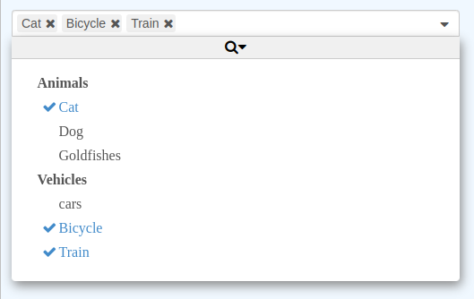

# Selectic

> VueJS 3.X + Typescript + JSX + Select

[](https://www.npmjs.com/package/selectic)

## Introduction

A customizable component allowing you to list and select items which embeds
the most common features like searching, remote data sets, infinite scrolling,
reverse selection, and many other possibilities.

It integrates well with VueJS and is reactive to option changes.

Typescript types are provided.

There are very few dependencies and code stays very small (~90kB).



## Example

```html
<Selectic
    :options="['first choice', 'second choice', 'third choice']"
    v-model="selection"
/>

<Selectic
    multiple
    value="item2"
    :options="[{
        id: 'item1',
        text: 'The first item',
        icon: 'fa fa-thumbs-o-up',
    }, {
        id: 'item2',
        text: 'Another item',
        title: 'second choice',
    }, {
        id: 'item3',
        text: 'Disabled item',
        disabled: true,
    }]"

    @input="onChange"
/>

<Selectic
    :options="[{
        id: 'animals',
        text: 'Animals',
        options: [{
            id: 'cat',
            text: 'Cat',
        }, {
            id: 'dog',
            text: 'A dog',
        }, {
            id: 42,
            text: '42 goldfishes',
        }],
    }]"
/>
```

[Full documentation](./doc/main.md)

## Features

* List of items (either string array or object array).
* Can load dynamically list from a server and the list can be paginate (with a
  cache system to avoid reloading previous requests).
* ~~Slots: options may be added from Vue template (by writing explicit `<option>` or `<optgroup>`) in a reactive way~~ _(currently disabled in 3.0.0+)_.
* Multi-sources: Possibility to combine options from different sources (static, dynamic or slots) or to use the other as fallback (if the list is empty).
* Supports basic Select properties like `multiple`, `disabled`, `title`
* Supports group element (equivalent of optGroup), even for dynamic list.
* Supports `placeholder` to display a default text when there is no selection.
* Keyboard shortcuts works.
* Possibility to search for any string in options.
* Scroll bar always indicates the size of the list (even for dynamic list),
  next pages to fetch are already computed the size of the list.
* Performance optimization for list containing large number of items.
* Emits `input`, `change`, `open`, and `close` events.
* Supports a reverse selection system (for very long list where only some
  elements are not selected).
* All displayed text can be changed (for example, to translate them in another
  language).
* Options to auto-disable the component when there is no options or only one
  mandatory option.
* Handle selection overflow either by displaying a tag "+x more" either by adding several lines and show all selected options.
* Possibility to open the component programmatically.
* CSS styles can be easily changed to fit your theme.
* Strong typing: all Typescript types are provided.

## Documentation

[Read the documentation](./doc/main.md) to know how to configure Selectic and all its possibilities.

For users which are used to previous Selectic versions, they can read the [migration strategy guide](./doc/breakingChanges.md).

It uses [VTYX](https://github.com/Intersec/vtyx) for strong typing.

## Tests

First build all files:
```console
$ npm run build
```

Run unitary tests:
```console
$ npm run test
```
