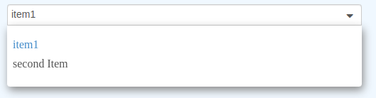
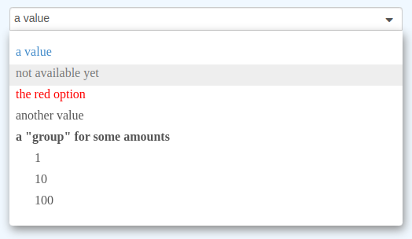

# Options

[Back to documentation index](main.md)

`options` is a props that builds the list of options. It should be an array.
content of this array can be either `string` either an `object` which define the option property.

## strings[]

In such case id and text displayed will be the same. Their id/text will be the array values.

```javascript
const items = ['item1', 'second Item'];
```

```html
<selectic
    :options="items"
/>
```


## object[]

It is possible to define the `option` more precisely.

* **id** {`string | number`} _(mandatory)_: The option identifier. *It is important that it is unique among all other options*.
* **text** {`string`} _(mandatory)_: The text which is displayed to select the option or when it is selected.
* **title** {`string`}: Text displayed in `title` when cursor is over the option (default: `''`).
* **disabled** {`boolean`}: if `true`, this option cannot be selected (default: `false`).
* **className** {`string`}: `class` that are applied on the option (default: `''`).
* **style** {`string`}: css style which are applied on the option (default: `''`).
* **icon** {`string`}: class names which are applied on a `<span>` before text in the option to display an icon (default: `''`).
* **options** {`options[]`}: an other list of options. The current option is considered as a group (equivalent of `optgroup`) (default: `undefined`).
* **group** {`string | number`}: If set, the option is part of the given group. This property is needed only in dynamic mode if the option is part of an optgroup (default: `null`).
* **exclusive** {`boolean`}: If set to `true`, in multiple mode, this option will be the only one selected. It means that it clears the previous selected options, and if another option is selected, this option is no more selected.
* **data** {`any`}: You can store any information here, it will be provided when getting selected options. _It is not used by selectic so it can be anything you want_ (default: `undefined`).

```javascript
const items = [{
    id: 1,
    text: 'a value',
}, {
    id: 2,
    text: 'not available yet',
    disabled: true,
}, {
    id: 3,
    text: 'the red option',
    style: 'color: red',
}, {
    id: 4,
    text: 'another value',
}, {
    id: 'group1',
    text: 'a "group" for some amounts',
    options: [{
        id: 'amount1',
        text: '1',
    }, {
        id: 'amount2',
        text: '10',
    }, {
        id: 'amount3',
        text: '100',
    }],
}];
```

```html
<selectic
    :options="items"
/>
```


# Inner elements _(deprecated)_

**:warning: This part has been deprecated with Selectic 3 +.**
_The main reason is that VueJS 3 does not allowed to read slots as easily as in VueJS 2._

Another way to create a list is to write elements as child of Selectic.

The child elements should be `<option>` or `<optgroup>` elements;

These elements will be converted into objects described above.

Element properties:

* **id** or **value**: will set the **id** attribute. Be careful the type will be only string. If both _value_ and _id_ are set, _value_ is the one which will be used.
* **title**: will set the **title** attribute.
* **disabled**: will set the **disabled** attribute.
* **class**: will set the **className** attribute.
* **style**: will set the **style** attribute.
* any **data-**: will set the **data** attribute.
* Inner text will set the **text** attribute.
* **label** _(only for optgroup)_: will set the **text** attribute.

```html
<selectic>
    <option value="1">
        a value
    </option>
    <option value="2" disabled>
        not available yet
    </option>
    <option value="3" style="color: red">
        the red option
    </option>
    <option value="4">
        another value
    </option>
    <optgroup id="group1" label="a &quotes;group&quotes; for some amounts">
        <option value="amount1">
            1
        </option>
        <option value="amount2">
            10
        </option>
        <option value="amount3">
            100
        </option>
    </optgroup>
</selectic>
```


If options are set both by options attribute and by inner elements,
the inner elements are added first and then the one described in
options attribute.

To change this behavior watch the **optionBehavior** property of the [params](params.md) attribute.
