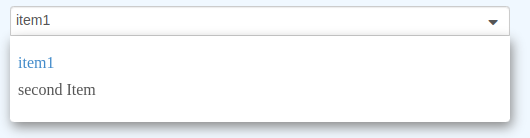
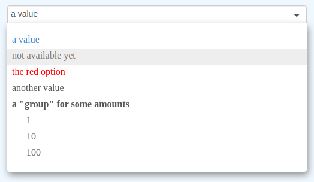

# Options

[Back to documentation index](main.md)

`options` is a props that builds the list of options. It should be an array.
content of this array can be either `string` either an `object` which define the
option property.

## strings[]

In such case id and text displayed will be the same. Their id/text will be the
array values.

```javascript
const items = ['item1', 'second Item'];
```

```html
<selectic
    :options="items"
/>
```


## object[]

It is possible to define the `option` more precisely.

* **id** {`string | number`} _(mandatory)_: The option identifier. *It is
  important that it is unique among all other options*.
* **text** {`string`} _(mandatory)_: The text which is displayed to select the
  option or when it is selected.
* **title** {`string`}: Text displayed in `title` when cursor is over the option
  (default: `''`).
* **disabled** {`boolean`}: if `true`, this option cannot be selected (default:
  `false`).
In "multiple" mode, if the option is already selected, it cannot be removed from
selection (it can always be removed by changing `value` of the component).
* **className** {`string`}: `class` that are applied on the option (default:
  `''`).
* **style** {`string`}: css style which are applied on the option (default:
  `''`).
* **icon** {`string`}: icon displayed before the text — both in the dropdown
  option **and** next to the selected value(s) in the input (default: `''`).

  The value is a list of class names, which are applied on a `<span>`.
  Prefixed with `img:`, the rest of the value is the URL of an image to
  display instead. Any scheme is accepted, `blob:` and `data:` as well as
  `https:`.

  ```javascript
  const options = [
      { id: 1, text: 'With a class', icon: 'fa fa-star' },
      { id: 2, text: 'With an image', icon: 'img:https://example.org/a.png' },
      { id: 3, text: 'With a blob', icon: 'img:blob:https://example.org/9d4b' },
      { id: 4, text: 'With an empty box', icon: 'img:' },
      { id: 5, text: 'Without any icon' },
  ];
  ```

  The image is displayed in a square box of a fixed size, which is reserved
  before the image is loaded. The box is kept even when the image cannot be
  loaded, so that the option stays aligned with the others. Its size and its
  border radius are set with the
  [CSS variables of the options](css.md#options).

  `img:` alone, without any URL, displays the empty box (option 4 above).
  This is how an option with no image stays aligned in a list where the
  others have one. An option with no `icon` at all reserves no space (option
  5 above).

  An `img:` value is not resolved through the
  [icon families](changeIcons.md#icon-family).

* **options** {`options[]`}: an other list of options. The current option is
  considered as a group (equivalent of `optgroup`) (default: `undefined`).
* **group** {`string | number`}: If set, the option is part of the given group.
  This property is needed only in dynamic mode if the option is part of an
  optgroup (default: `null`).
* **exclusive** {`boolean`}: If set to `true`, in "multiple" mode, this option
  will be the only one selected. It means that it clears the previous selected
  options, and if another option is selected, this option is no more selected.
* **data** {`any`}: You can store any information here, it will be provided when
  getting selected options. _It is not used by selectic so it can be anything
  you want_ (default: `undefined`).

```javascript
const items = [{
    id: 1,
    text: 'a value',
}, {
    id: 2,
    text: 'not available yet',
    disabled: true,
}, {
    id: 3,
    text: 'the red option',
    style: 'color: red',
}, {
    id: 4,
    text: 'another value',
}, {
    id: 'group1',
    text: 'a "group" for some amounts',
    options: [{
        id: 'amount1',
        text: '1',
    }, {
        id: 'amount2',
        text: '10',
    }, {
        id: 'amount3',
        text: '100',
    }],
}];
```

```html
<selectic
    :options="items"
/>
```


# Inner elements _(deprecated)_

**:warning: This part has been deprecated with Selectic 3 +.**
_The main reason is that VueJS 3 does not allowed to read slots as easily as in
VueJS 2._

Another way to create a list is to write elements as child of Selectic.

The child elements should be `<option>` or `<optgroup>` elements;

These elements will be converted into objects described above.

Element properties:

* **id** or **value**: will set the **id** attribute. Be careful the type will
  be only string. If both _value_ and _id_ are set, _value_ is the one which
  will be used.
* **title**: will set the **title** attribute.
* **disabled**: will set the **disabled** attribute.
* **class**: will set the **className** attribute.
* **style**: will set the **style** attribute.
* any **data-**: will set the **data** attribute.
* Inner text will set the **text** attribute.
* **label** _(only for optgroup)_: will set the **text** attribute.

```html
<selectic>
    <option value="1">
        a value
    </option>
    <option value="2" disabled>
        not available yet
    </option>
    <option value="3" style="color: red">
        the red option
    </option>
    <option value="4">
        another value
    </option>
    <optgroup id="group1" label="a &quotes;group&quotes; for some amounts">
        <option value="amount1">
            1
        </option>
        <option value="amount2">
            10
        </option>
        <option value="amount3">
            100
        </option>
    </optgroup>
</selectic>
```


If options are set both by options attribute and by inner elements,
the inner elements are added first and then the one described in
options attribute.

To change this behavior watch the **optionBehavior** property of the
[params](params.md) attribute.
